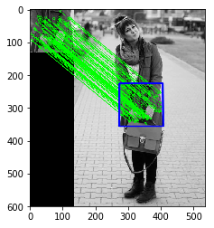
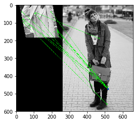

#  Images-Crops Association
## Objective 
To identify associations between the provided crops and images, and output this as a JSON file. 

## Installation
Run the setup file to install the dependencies : 

```bash
python setup.py install
```
## Usage

```bash
usage: main.py [-h] (--images IMAGES | --image_url_file IMAGE_URL_FILE)
               (--crops CROPS | --crops_url_file CROPS_URL_FILE) --output
               OUTPUT [-g GROUNDTRUTH]
 ```

## Run the demo

```bash
python main.py --images $images_path$ --crops $crops_path$ --o $output_path$ -g $ground_truth$
```
or

```bash
python main.py --image_url_file $images_path$ --crops_url_file $crops_path$ --o $output_path$ -g $ground_truth$
```

Example : 
```bash 
python src/main.py --images data/sample_testset/images/ --crops data/sample_testset/crops/ --o output/sample_testset/result.json -g data/sample_testset/out_res.json 
```
or
```bash
python src/main.py --image_url_file data/images.txt --crops_url_file data/crops.txt --o output/result.json
```

## Description 

The Image-Crops-Association is developed as a CLI tool that is capable of providing image crop asssociations as a JSON output file given the paths of the images and crops folders or their metadata file. The CLI has the following required and optional arguments, 

Required arguments : 

    --images and --crops :  Path to images and crops folder
    
    --image_url_file and --crops_url_file : Path to the metadata file with urls to download
    
    --output : Output file path

Optional arguments :

    -g : To provide the ground truth file and evaluate the associations for average precision, recall and accuracy. 

The tool was developed mainly by using the openCV library. The matchTemplate of openCV was used to perform a template matching[1]. Template matching is a technique for finding areas of an image that match (are similar) to a template image (patch). OpenCV provides 6 methods to perform this template matching, all these were explored and it was found that most of these functions returned similar results except for CV_TM_CCORR function. So we chose TM_CCOEFF_NORMED function to perform the template matching. Once this was understood, we setup a threshold matching of 99% to ensure we match each image to its right associations and eliminate the others. These associations of each image were found based on the given problem constraints and were written to a JSON file. 

Initially, this was done on the S3 data (whose metadata links were provided), for hyperparameter tuning of the type of openCV function to be used, and then on the sample test data. The template matching algorithm was run on the sample test data and further evaluated using the ground truth information provided. Various metrics such as accuracy, recall and precision were calculated on an average. 

### Metric selection for Evaluation:
Based on the results it was observed that accuracy was not a right parameter to judge the entire model as the number of positive samples were less. The mjor focus was thus on the average recall and precision as this helped to understand how correctly the association was provided for each of the image. Using the template matching algorithm an average accuracy =  97.81%, average recall = 46.8%, average precision = 54.23% was achieved. 

Based on the analysis and evaluation of the model, the following were the shortcomings of the above template matching model :
* The given model could not take into consideration the rotation of images, i.e. the rotated crop images were not mapped to their corresponding images. 
* Also, it was not perfect enough to tell majorly if crop does not appear in an image. This needs to be carefully tuned and will be still subject to tuning assumptions. 

## Improvements Implemented
Based on the shortcomings of the previous method, a major consideration was now to map images to their crops irrespective of their orientation. Though template matching based algorithm was capable in multiscale image matching, it couldn't take into consideration the rotations and other orientations into matching. 

To address this, a feature based algorithm was explored [2]. The major steps involved in this are, 
* Interest / Key Point Detection : to find relevant points in pictures, to encode them later as a representation of the original picture. 
*  Descriptor Extraction : to extract a small patch around each keypoint, preserving the most relevant information and discarding unnecessary information
* Feature Representation 
* Feature storage and datastructure
* Distance choice
* Matching and selection
* Model fitting

On these lines, a SIFT (Scale-Invariant Feature Transform)[3] was used. This was not integrated into the CLI interface. The detector notebook in src folder has implementation details on this and a sample set of images were executed to observe that it is rotation and shift invariant and also helps in identifying if a crop does not appear in an image. The above steps were closely followed, _**creating a SIFT detector, detection and computing the keypoints descriptors with SIFT, using a FLANN Based matcher, perspective transforms**_. Later a blue rectangle is built visually represent the findings. 

The mapping can be represented as images below,

* **Regular mapping** : 



* **Rotated Image mapping** : 


* **Incorrect image mapping** : 



In case of incorrect mapping it can be observed that no proper rectangle is obtained. 

## Further Future Work
* To include the SIFT based detector as part of the CLI
* To explore other detectors and also add them to the CLI so that the user can choose how they want to match the images. 

## References
[1] https://docs.opencv.org/2.4/doc/tutorials/imgproc/histograms/template_matching/template_matching.html

[2] https://github.com/CIRCL/carl-hauser/blob/master/SOTA/SOTA.md

[3] https://docs.opencv.org/3.4/da/df5/tutorial_py_sift_intro.html
